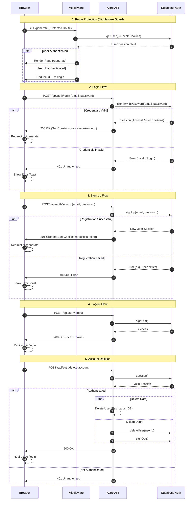

# Authentication Architecture

<authentication_analysis>
1. **Authentication Flows**:
   - **Initial Request / Route Guard**: The middleware intercepts requests to protected routes (`/generate`, `/flashcards`, etc.) to verify the user session via Supabase.
   - **Login**: User submits credentials via `LoginForm`. The Astro API communicates with Supabase Auth to validate credentials and establish a session.
   - **Sign Up**: New user registration via `SignUpForm`. The Astro API requests Supabase Auth to create a new user.
   - **Logout**: User terminates the session. Astro API notifies Supabase and clears cookies.
   - **Account Deletion**: User requests account removal. Astro API coordinates data cleanup and auth user deletion.

2. **Actors & Interactions**:
   - **Browser**: Initiates requests, renders UI, handles client-side redirection and feedback (toasts).
   - **Middleware**: Runs on the server (Astro) for every request. Checks `context.locals.supabase.auth.getUser()` to enforce access control.
   - **Astro API**: Server-side API endpoints (`src/pages/api/auth/*`) that handle mutation requests (POST) and communicate with Supabase.
   - **Supabase Auth**: The identity provider handling user storage, JWT generation, and validation.

3. **Step Descriptions**:
   - The **Middleware** acts as the gatekeeper, redirecting unauthenticated users to `/login` and authenticated users away from `/login`.
   - **Login/Signup** endpoints proxy requests to Supabase, setting the returned session cookies so the browser and middleware can persist the state.
   - **Logout** ensures both the Supabase session is invalidated and the local cookies are cleared.
   - **Account Deletion** is a critical security action requiring authentication verification before destructive operations.
</authentication_analysis>

<mermaid_diagram>

</mermaid_diagram>
